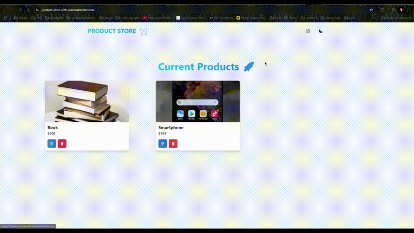
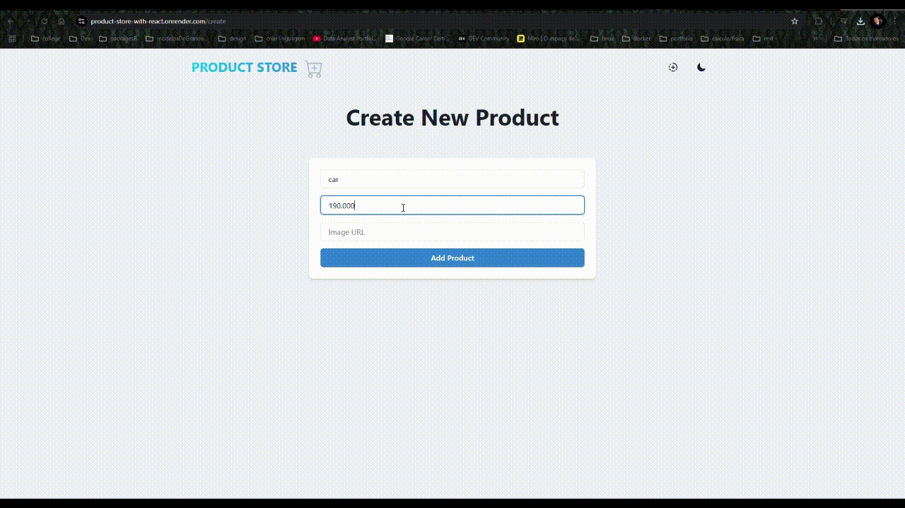
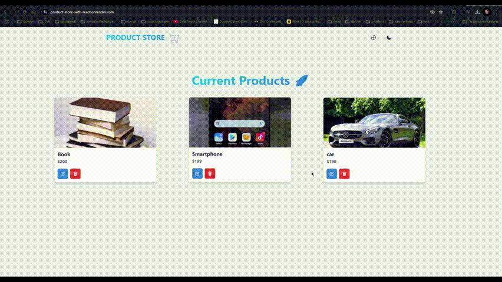
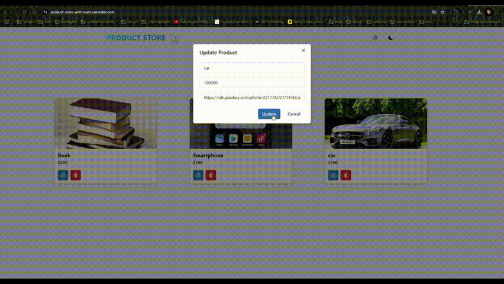

# Product Store

 
<ul> 
    <li><b>Tech Stacks:</b> Tech Stack: React.js, Node.js, Express.js, MongoDB, Chakra UI
    <li> 🔥 Build an API
    <li> 📱 Responsive UI With React.js and ChakraUI
    <li> 🐞 Error Handling
    <li> 🌐 Deployment
</ul>

### Setup .env file

```shell
MONGO_URI=your_mongo_uri
PORT=5000
```

### Run this app locally

```shell
npm run build
```

### Start the app

```shell
npm run start
```

<div style="display: flex; gap: 20px;"  >
    
    
</div>

<div style="display: flex; gap: 20px;"  >
    
    
</div>

<div style="display: flex; gap: 20px;"  >
    
    
</div>